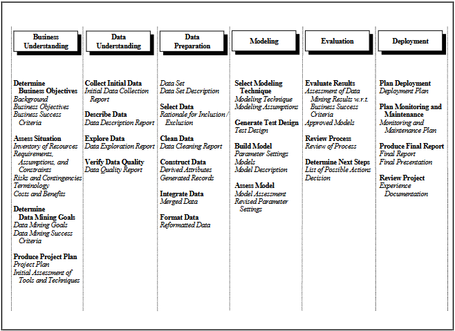
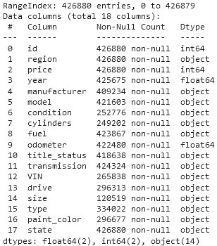
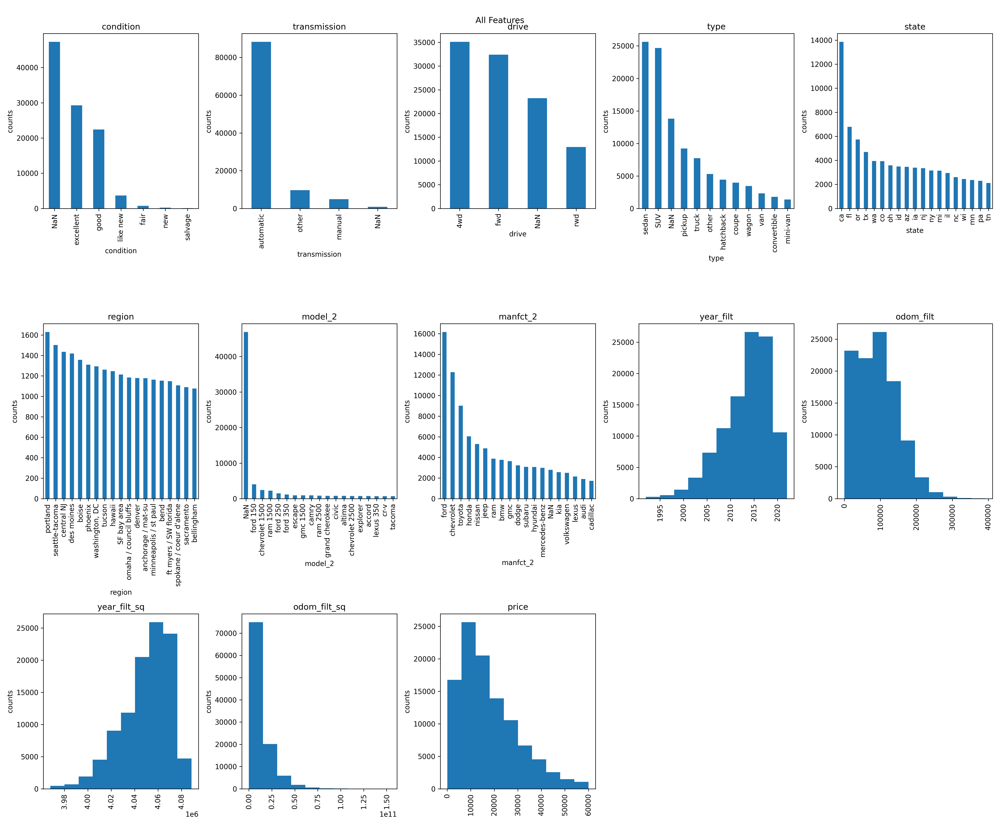
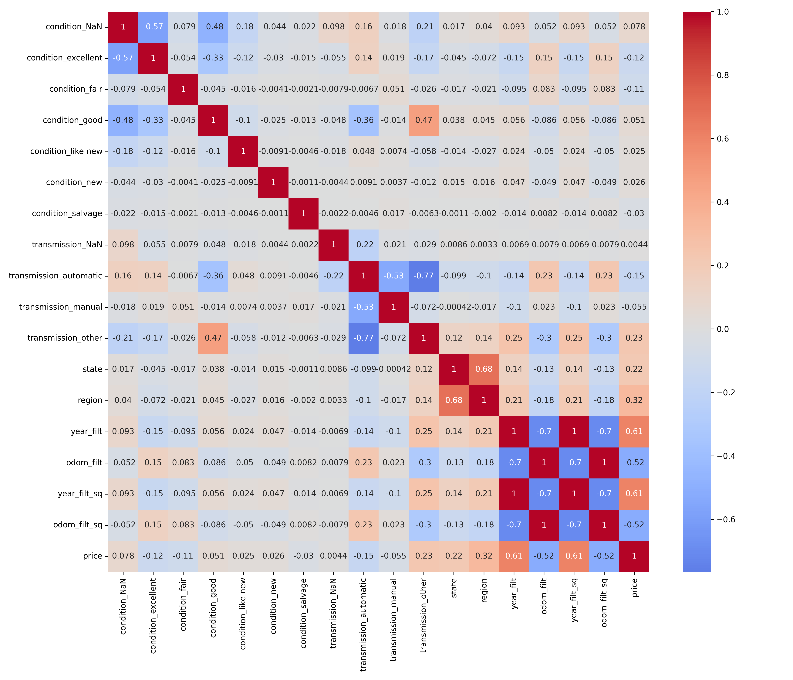
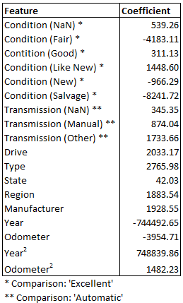
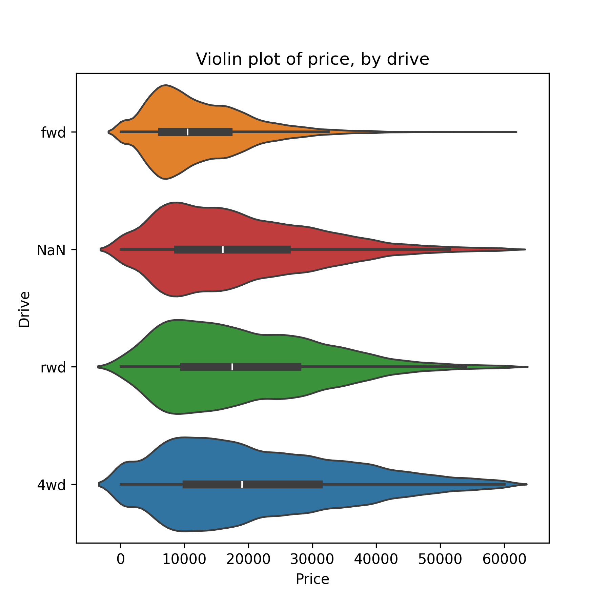
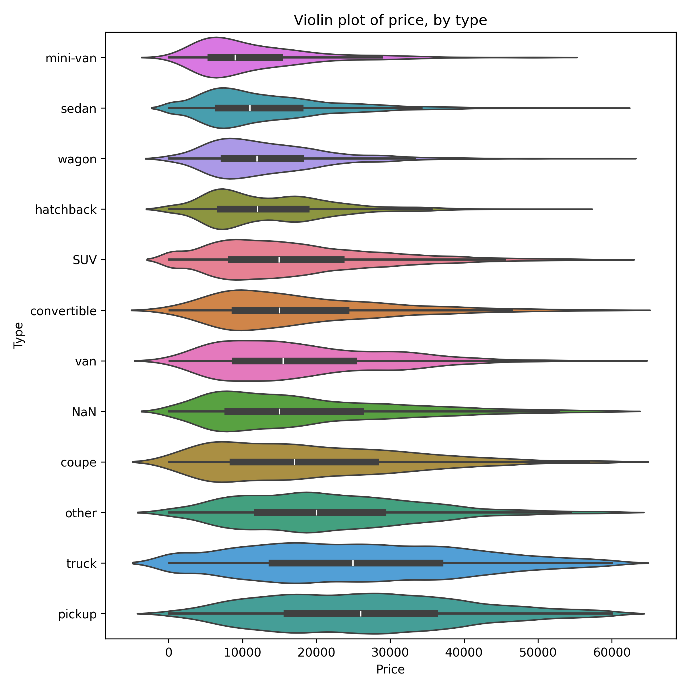
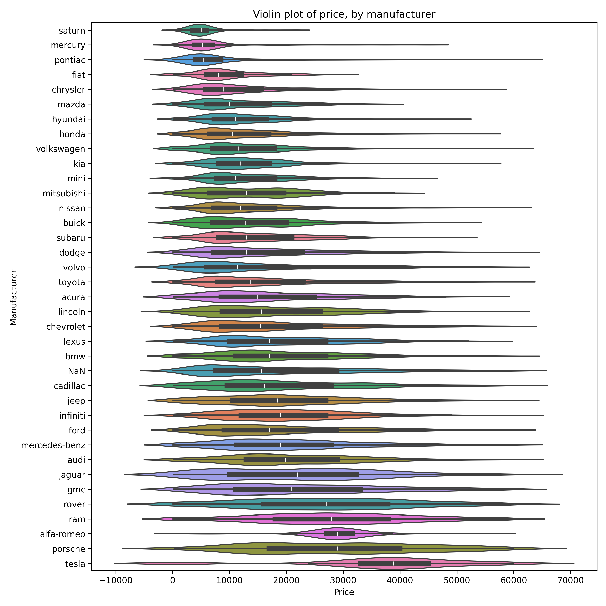
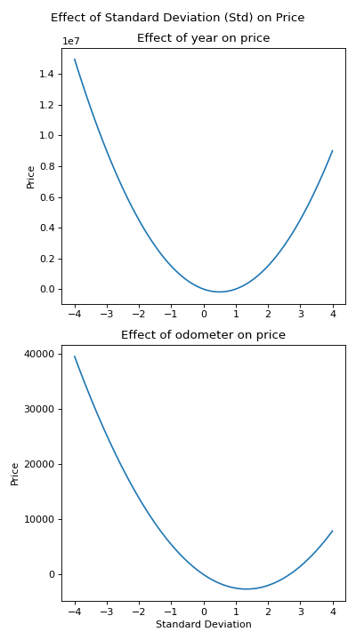

<h1 style="text-align: center; color: blue;">What Drives the Price of a Car?</h1> 

This repo uses machine learning techniques to explore the <a href="https://www.kaggle.com/datasets/austinreese/craigslist-carstrucks-data">a used cars dataset</a>, scraped from Craigslist. For this project, Python was used, in <a href = https://github.com/mattbenn/Practical-Application-2/blob/main/Bennett_used%20cars.ipynb>Jupyter Notebook</a>.

The CRISP-DM process model was used to conduct the project, as visualized below in Figures 1 and 2.

<h4 align="center"> Figure 1</h4>

<h4 align="center"> Figure 2</h4>

This report will contain a summary of the whole process; see the notebook for more details.
<h2>Business Understanding & Assessing the Situation</h2>
<h3>Determine Business Objectives</h3> As profit-driven enterprises, used car dealerships are interested in maximizing their business profits. This requires them to know which cars are likely to sell for more. My goal in this project is to take objective sales data from Craigslist and extract useful information about which features drive sales prices, and distill this into useful information that used car dealers can use to improve their business strategies by acquiring, maintaining, and advertising high-value inventory.

There are a few key assumptions being made with this modeling. I am assuming that the customer segment represented in this data will show similar patterns of purchasing behavior as the clientelle of a used car dealership. If that is <i>not</i> the case, then the value of the insights I will provide is limited, and so care should be taken to delineate which factors within the data might moderate the relationships between car characteristics and sales price.

<b>Risks and benefits</b>: There are tangible benefits that could result from using this data to alter business behavior. Because this information will pertain to the relationship between inventory characteristics and will be interpreted in terms of statistical relationships, there is the strong possibility that using this data wisely will increase profits. However, because market conditions specific to a single business, including local market rates for used cars, may be different from national data, it should be stressed that the value of this information comes in identifying which inventory characteristics are likely to drive increased profit margins, rather than offering specific predictions of how much increase in profit margins there will be.

There is a risk that the data I am working with will be too out of date, or not relevant enough to local market trends to see the expected increase in profits. Therefore, all necessary precautions should be taken to minimize this risk by running analyses on local subsets of data (more on this at the end), and a plan should be set in place to continually evaluate business performance against projections, to test for the net profit increase resulting from this information.

<h3>Data Mining Goals & Project Plan</h3> The goals of this project will be to identify the relationships between used car characteristics (predictors) and sales prices (target). This will require a thorough evaluation of the dataset, identifying and possibly controlling for the bivaraiate and multivariate relationships between predictors, and theoretically sound assumptions behind choosing which model to use to evaluate predictor-target relationships. Data-mining will be successful if strong relationships can be found between car characteristics and sales prices. Because we can assume <i>a priori</i> that sales prices are not random, if I can find no relationships in our dataset, it is most likely because the dataset does not contain enough information, or there was an error in data analysis or the original data scraping.

The data has already been scarped from the internet, and only exploratory data analysis, data cleaning, and data modeling are left. The project will consist of the aforementioned data preprocessing and data processing steps, as well as writing a summary of findings for presentation to the client (the used car dealer).

<h2>Data Understanding</h2>
The <a href="data/vehicles.csv">scraped dataset</a> is in .csv format and, before data cleaning, contains 18 features of over 426,000 observations:

Features include state and region (where the ad was placed), car manufacturer and car model, manufacturing year and odometer, and other pertinent information such as car condition, number of cylinders, and paint color. Our target feature is car price, a numeric feature ranging from $0 - $3.7b. Most features are categorical, meaning that we'll have to conduct encoding to find how they relate to price.

Data was not missing at all for price, state, and region, but all other features had at least some missing values. I decided to deal with these in different ways, as detailed later in this report.

<h2>Data Preparation</h2>
<h3>Data Cleaning</h3>
The data has no duplicate rows, but Vehicle Identification Numbers (VIN numbers) are included, and no two cars can have the same VIN number and same manufacturer. After some investigation I discovered that these duplicates were due to cross-posting the same car ad on multiple regions of Craigslist. I removed these duplicate rows. Additionally, there are significant outliers in the car price feature (our target feature), as well as over 3,200 rows where the price is 0. After some exploration of cars at different price points, I decided to filter the dataset and keep only observations where the car price was between $100 - $60k, because $60k seemed like about the range where the listed price started to be higher than even the MSRP price for new models of those cars.

After filtering for price and removing duplicate VIN numbers, there were 103.6k rows left in the data. Most of the dropped rows were dropped due to duplicate VIN numbers.

I also looked closely at car manufacturer and car model. There were 41 different manufacturers and 15,960 different models listed in the dataset. I wanted to standardize both columns if possible to reduce the different number of values, since each value would need to be encoded numerically.

<ul>
<li><b>Manufacturer:</b> Most manufacturers were present over 100 times in the data. I removed these from the dataset.</li>
<li><b>Model:</b> Because there were so many models in the dataset, and I would use encoding to transform categorical data to numeric, I wanted to find a way to reduce the total number of models. This value seemed to be a write-in field, meaning that sellers could make spelling mistakes when inputting their car's model. I combined many models by identifying when a common model number (e.g., 1500) was in the model feature. After this procedure, I again replaced any model value that appeared less than 100 times with 'NaN'.</li></ul>

With the initial data cleaning completed, I moved on to data selection & feature engineering.

<h3>Data Selection & Feature Engineering</h3>
<b>Numeric Features:</b>

After the initial data cleaning, the price looked good, but year and odometer still had significant outliers:

<h4 align="center">Figure 3</h4>

I filtered both features to remove very high and very low values (+/-3 SDs away from the mean). Additionally, I created features that were the square of both year and filter, to check for quadratic relationships between these features and price.

<b>Categorical Features:</b>

I carefully reviewed the number of unique categories in each categorical feature, and decided on whether to use one-hot encoding (OHE), target encoding (TE), or to drop each feature.
<ul>
<li><b>Drop:</b> I dropped number of cylinders, fuel, title_status, car size, and car paint color due to too many missing values in each feature. Additionally, I ended up removing car model because, even with my previous engineering, there were too many missing values.</li>
<li><b>OHE: </b>I used OHE to transform condition and transmission into multiple binary (0/1) columns, because there were only a few categories for each of these, and in this analysis OHE will be easier to interpret than TE.</li>
<li><b>TE: </b>I used TE to transform car drive (4WD, etc.), car type (sedan, SUV, etc.), state, region, and manufacturing. TE will tell us if there's a significant effect of the category on price, but it won't tell us anything about which categories are associated with higher prices; for that insight I will use visualizations.</li>
</ul>

With this, the data was prepared for modeling. The plot matrix below (Figure 4) shows bar charts and histograms for all final features that will be included.

<h4 align="center">Figure 4</h4>

<h2>Modeling</h2>
<h3>Pre-modeling correlation</h3>
Before modeling, I ran the correlations as they exist in the whole dataset, without running a test/train split:

To better approximate the relationships between OHE features and price, I calculated Spearman's rho correlations; this explains why the correlations between year and year2, and odometer and odometer2, are 1. Because there is going to be some multicollinearity between OHE features, and also between state and region, I will try regularization via Ridge and Lasso regression.
  
<h3>Modeling Technique & Test Design</h3>
For data modeling, I used an 80/20 test-train split with 5-fold cross-validation. I tested both Ridge and Lasso regression, testing alpha parameters on powers of ten, from 10-3 to 103. When I included all features, the Ridge model performed the best (RMSE = 8166.22; R2 = .22), with an alpha parameter of 1.0. With this root mean squared error, or RMSE, we can expect most predicted price values in the test dataset to be within $8166.22 of where they actually are. The R2 value of .22 means that we can predict about 22% of the variance in price, using our model. However, the model coefficients for year and year2 were very large in magnitude, and in opposite directions. While this isn't a problem, it makes interpretation a bit harder. I tried a second model, without the square of year, but the R2 value (.18) for that model was much lower. I decided to stick with the first model.

<h2>Evaluation</h2>
<h3>Model Coefficients</h3>
In the best-performing model, these are the coefficients:

<h3>Interpreting OHE Features</h3>
For car condition, all coefficients should be interpreted as the additional value of being listed as that condition, when compared to cars listed as being in 'Excellent' condition. So, for example, if a car is listed as being in 'Fair' condition, we could expect a total decrease in price of about $4.2k, whereas if listed as 'Like New', the car is likely to be worth about $1.4k more. For car transmission, the comparison category is 'Automatic'. Because the transmission coefficients are all positive, on average, if a car was not an automatic it sold for a higher price than other cars.

<h3>Interpreting TE Features</h3>
Target Encoding (TE) is useful for encoding features with many categories, but a large coefficient only tells us that this feature is somehow connected to price. For this analysis, to aid in interpretation, I have produced violin plots for drive, type, and manufacturer. Region also had a large coefficient but this will be discussed in the next section.

Based on the above, we can see that car drive is connected to price. Cars with 4WD (four-wheel drive) have a higher average price, as do cars with RWD (rear-wheel drive) when compared to FWD (front-wheel drive).

We can see that car type is also related to price. For instance, pickups tend to sell for the most, and mini-vans the least.

Finally, here we can see that car manufacturer is significantly related to price. Tesla, Porsches, and Alfa-Romeos tend to sell for the most, while Saturns and Mercurys tend to sell for the least. (This isn't surprising, since Teslas are all cutting-edge electric vehicles, and Porsches and Alfa-Romeos are luxury brands.)

<h3>Interpreting year and odometer</h3>
A point should be made about year and odometer. The model included degree-1 and degree-2 features for both. All four features are standardized with values between -4 and 4, meaning that there is not much difference between the absolute values for each degree of each feature (for instance, if the degree-1 value is 2, then the degree-2 value will be 4). The effect of both variables should be interpreted in light of this, and in light of the degree of difference between the coefficients for both variables. Although the coefficient for year and year2 are very large (abs. values > 744,000), the total effect of year should be interpreted in terms of the difference between the coefficients, which is ~4350. As the SD of the year increases, the price increases, meaning that newer cars will sell for more. Furthermore, the difference in signs means there's a quadratic relationships between year and price; at a certain point, older cars may sell for more, perhaps because they were kept in better condition. For odometer, there is a similar story, but odometer prices would have to be very high for them to add to the overall price (instead of substracting from the price). This may be because price may rapidly decrease as odometer increases, but then that rate of decline evens out. In fact, as can be shown in the graphs below, the reverse would not start to happen until a z-value of ~1.3 for odometer, whereas the increase starts ~0.50 for year.

When translating this information to the non-standardized values this means that, on average, price started increasing for cars made after 2015, and for cars with over 168k miles on the odometer.

<b>A note on vehicle model:</b> Throughout this project, there were many decision points that would affect the final regression model. The largest choice was probably leaving out car model. Car model will probably strongly predict price, because grouping vehicles of similar quality and luxury into similar model numbers is one of the marketing strategies used by automobile manufacturers. For instance, Honda Accords tend to be more expensive than Honda Civics, due to features like <a href=https://www.autonation.com/vehicle-research/honda-civic-vs-accord>advanced safety features and more advanced audio systems<a>. These are vehicle features not captured in other dimensions of our data, meaning that model will serve as a lower-dimension projection of these other features. So, it would likely increase predictive power if we included model, but because there were so many different models, it could not have been included with any real interpretation other than 'different models will sell for more on average than other models', and further work would be required to identify which models sold the most. There is a similar issue with manufacturer, but there were fewer manufacturers in the dataset, meaning that it was more feasible to include this in the model because the results could be visualized.

<h2>Findings & Future Directions</h2>
The business objective for this project was to identify the characteristics of cars that drive consumer spending on used cars, so as to effectively prioritize specific car characteristics for purchase and advertising. Certain features do stand out:

<ul>
<li>Condition is very important, and car condition is one of the strongest predictors of used vehicle prices. On average, 'salvage' cars sell for almost $10k less than 'Like New' cars.</l>
<li>4WD vehicles sell for the most, and FWD vehicles sell for the least.</l>
<li>'Pickups' tend to sell for more than 'trucks', and they on average the highest-selling vehicles, whereas mini-vans are the lowest-selling.</l>
<li>Manufacturer is important; Teslas sell for the most, and Saturns sell for the least.</l>
<li>In general, newer cars (cars with higher 'year' values) will sell for more, but this effect tapers off as cars get more recent.</l>
<li>Similarly, cars with less miles (lower 'odometer' values) tend to sell for more, but this effect tapers off as odometer values.</l>
<li>Region (and to a lesser extent, state) matter.</l>
</ul>

Because we found that there is an effect for region, used car dealerships should run a similar analysis as the one above on a subset of the data, using only their local markets. Additionally, my work only looked at whether there was a quadratic relationship between year and price, or between odometer and price. Future models should look at whether there are cubic relationships, since the finding for odometer--that prices on average should increase after ~168k miles--seems counterintuitive, as does the finding that car price should increase on average for cars made before 2015. Using higher-degree models may, in this instance, reveal more realistic relationships between these features.

